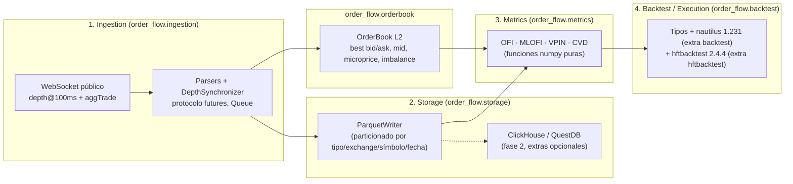

# order-flow-system

Sistema de análisis de *order flow* para futuros perpetuos de criptomonedas, **100 % open-source
y con datos públicos gratuitos** (sin licencias comerciales). El objetivo es capturar el order book
L2/L3 en tiempo real vía WebSocket (Binance USD-M Futures, Bybit, OKX — los streams públicos no
necesitan API key), reconstruir el libro localmente, calcular métricas de microestructura
(OFI, MLOFI, VPIN, CVD) y backtestear (con honestidad brutal) un MM pasivo sobre
Parquet L2 vía `nautilus_trader` y, para cola L2, `hftbacktest`.

> **Aviso:** este proyecto es investigación cuantitativa y software educativo. **No es asesoría
> financiera ni de inversión.** Lee el [Disclaimer](#disclaimer) completo antes de usarlo.

## Arquitectura de 4 capas



| Capa | Módulo | Responsabilidad |
| --- | --- | --- |
| 1. Ingestion | `order_flow.ingestion` | Conectar a los streams públicos, parsear mensajes a eventos tipados (`BookSnapshot`, `BookDelta`, `Trade`) y aplicar las reglas oficiales **futures** de sincronización del libro (`U <= lastUpdateId <= u`, luego `pu == u` previo; gap ⇒ resync). Publica a `asyncio.Queue`. Fase 1: adaptador Binance USD-M Futures. **El feed no escribe disco.** |
| — | `order_flow.orderbook` | Reconstruir el libro L2 a partir de snapshot + deltas con `SortedDict`; best bid/ask, mid, spread, microprice, imbalance, `depth_at_level` (nivel 1 = BBO), `snapshot()`, `is_synced`. [docs/orderbook/data-structure.md](docs/orderbook/data-structure.md). |
| 2. Storage | `order_flow.storage` | Parquet hive `snapshots/` `deltas/` `trades/`; `reconstruct_book`; informe de captura. Extra opcional `analytics` (DuckDB). Skeletons ClickHouse / QuestDB. [docs/storage/parquet.md](docs/storage/parquet.md). |
| 3. Metrics | `order_flow.metrics` | Funciones numéricas puras sobre arrays: OFI, MLOFI, VPIN (con clasificación por agresor o BVC) y CVD, cada una documentada con su fórmula y fuente en `docs/math/`. |
| 4. Backtest / Execution | `order_flow.backtest` | Tipos de dominio (`Order`, `Fill`, `Position`, protocolo `Strategy`). Adaptador `nautilus_trader` 1.231.0 (extra `backtest`) y segundo adaptador `hftbacktest` 2.4.4 (extra `hftbacktest`: cola `ProbQueueModel` + `PowerProbQueueFunc(n=2)`). **No** hay ejecución live. [docs/backtest_limitations.md](docs/backtest_limitations.md), [docs/backtest/queue_position_comparison.md](docs/backtest/queue_position_comparison.md). |
| transversal | `order_flow.utils` | Configuración vía `.env` (pydantic-settings), logging estructurado (structlog) y helpers de tiempo en nanosegundos. |

## Fuentes de datos

Todos los datos provienen de **streams públicos y gratuitos**, sin licencia comercial ni API key:

| Exchange | Producto | Streams usados | Estado |
| --- | --- | --- | --- |
| Binance USD-M Futures | perpetuos USDⓈ-M | `<símbolo>@depth@100ms` + `<símbolo>@trade` (mismo `m` que aggTrade; el WS `@aggTrade` estuvo silencioso el 2026-09-02); snapshot REST `GET /fapi/v1/depth` | **fase 1** |
| Bybit | perpetuos lineales (v5) | `orderbook.{depth}.{símbolo}` + `publicTrade.{símbolo}` | fase 2 |
| OKX | swaps perpetuos | `books` / `books-l2-tbt` + `trades` | fase 2 |

Las API keys que aparecen en `.env.example` solo se necesitarán en el futuro para endpoints
privados (ejecución); la captura de market data no las usa.

## Requisitos

- Python ≥ 3.11 (el repo fija 3.12 en `.python-version`).
- [uv](https://docs.astral.sh/uv/) como gestor de entorno y dependencias.

## Inicio rápido

```bash
uv sync                                   # crea .venv e instala deps + grupo dev
cp .env.example .env                      # opcional: ajusta rutas/credenciales
uv run pytest                             # tests + cobertura (umbral 80 %)
uv run pre-commit install                 # hooks de calidad en cada commit
uv run python scripts/record_l2.py --help # grabar L2 + trades a Parquet (default 300 s)
uv run python scripts/capture_report.py --help  # tasas, tamaños, huecos de una captura
uv run python scripts/validate_capture.py --help # integridad: cadena pu, grid, duplicados
scripts/install_capture_agent.sh BTCUSDT "$PWD/data/continuous" # captura continua (launchd)
uv run python scripts/validate_live_l2.py --help  # 60s de honestidad L2, sin Parquet
uv sync --extra backtest                          # instala nautilus_trader 1.231.0
uv run python scripts/run_ofi_mm_backtest.py --help  # MM sesgado por OFI (no es un edge)
uv sync --extra hftbacktest                       # instala hftbacktest 2.4.4 (cola ProbQueue)
uv run python scripts/run_ofi_mm_hftbacktest.py --help
uv run python scripts/latency_audit.py --help        # latencia pública WS; no envía órdenes
```

Validación del protocolo USD-M (reconstrucción + comparación REST, 60 s).
Ese comando **no** mide la cobertura del paquete (un solo test cubre ~20 %).
La cifra del 80 % es `uv run pytest` (suite completa):

```bash
uv run pytest
RUN_INTEGRATION=1 uv run pytest tests/integration/test_binance_live_l2.py -v -s
```

Protocolo oficial y diferencia vs Spot: [docs/ingestion/binance-futures-l2.md](docs/ingestion/binance-futures-l2.md).
Resultado del último run en esta máquina: [docs/ingestion/live-validation.md](docs/ingestion/live-validation.md).

Auditoría de latencia (sonda pública, **sin órdenes**; candado antes de cualquier ejecución, incluido testnet):

```bash
uv run python scripts/latency_audit.py --symbol BTCUSDT --n-events 10000
```

Decisión: [docs/go_no_go_decision.md](docs/go_no_go_decision.md). Cifras: [docs/latency/latency_audit_results.md](docs/latency/latency_audit_results.md). **NO-GO** para capa de ejecución en vivo.

Ejemplo de grabación de 5 min de `BTCUSDT` (mainnet público, sin API key):

```bash
uv run python scripts/record_l2.py --symbol BTCUSDT --seconds 300 \
  --out data/live-btcusdt-5min --snapshot-interval 1 \
  --report docs/storage/live-capture.md
uv run python scripts/capture_report.py data/live-btcusdt-5min
```

El script respeta `CAPTURE_SECONDS` si no pasas `--seconds`. Resultado de una
corrida en esta máquina (5 min, no 10): [docs/storage/live-capture.md](docs/storage/live-capture.md).

Validación empírica de OFI (OLS lead-1 vs contemporánea, 1s/5s/10s):

```bash
uv run python scripts/record_l2.py --symbol BTCUSDT --seconds 2700 \
  --out data/live-btcusdt-45min --snapshot-interval 1
uv run --extra notebooks python scripts/validate_ofi.py \
  --root data/live-btcusdt-45min --report docs/math/ofi_validation.md
```

Informe: [docs/math/ofi_validation.md](docs/math/ofi_validation.md).

Validación MLOFI (OFI L1 vs suma de 5 vs suma de 10 niveles, lead-1 y contemporánea):

```bash
uv run --extra notebooks python scripts/validate_mlofi.py \
  --root data/live-btcusdt-45min --report docs/math/mlofi_validation.md
```

Informe: [docs/math/mlofi_validation.md](docs/math/mlofi_validation.md).
Notebook: [notebooks/mlofi_vpin_validation.ipynb](notebooks/mlofi_vpin_validation.ipynb).

Uso básico de la librería:

```python
import numpy as np

from order_flow.metrics.ofi import compute_ofi_events

bid_px = np.array([100.0, 100.0, 100.5, 100.5])
bid_qty = np.array([10.0, 12.0, 5.0, 5.0])
ask_px = np.array([101.0, 101.0, 101.0, 100.8])
ask_qty = np.array([8.0, 8.0, 6.0, 4.0])
print(compute_ofi_events(bid_px, bid_qty, ask_px, ask_qty))  # [ 2.  7. -4.]
```

## Estructura del repositorio

```
.
├── pyproject.toml            # metadatos, dependencias, ruff, mypy, pytest, coverage
├── uv.lock                   # lockfile reproducible (se versiona)
├── .python-version           # 3.12
├── .env.example              # plantilla de configuración (sin valores reales)
├── .pre-commit-config.yaml   # ruff, mypy, uv-lock, hooks básicos
├── src/order_flow/
│   ├── ingestion/            # eventos, protocolo MarketDataFeed, adaptador Binance Futures
│   ├── orderbook/            # OrderBook L2 + errores (SequenceGapError, EmptyBookError)
│   ├── storage/              # ParquetWriter / lectura polars; skeletons ClickHouse, QuestDB
│   ├── metrics/              # ofi, stream, batch, windows, mlofi, vpin, cvd
│   ├── backtest/             # tipos + nautilus (extra backtest) + hftbacktest (extra hftbacktest)
│   └── utils/                # config (.env), logging, time
├── tests/
│   ├── unit/                 # tests deterministas (pytest + hypothesis)
│   └── integration/          # requieren red; se saltan salvo RUN_INTEGRATION=1
├── notebooks/                # exploración y validación de métricas
├── docs/
│   ├── architecture.md       # capas, flujo de datos, esquema de eventos, reglas de resync
│   ├── go_no_go_decision.md  # candado: NO-GO ejecución en vivo (incl. testnet)
│   ├── latency/              # resultados de la sonda de latencia (esta máquina)
│   ├── backtest_limitations.md  # qué NO modela el replay nautilus
│   ├── backtest/             # resultados OFI-MM (pipeline, no un edge)
│   ├── orderbook/            # decisión SortedDict vs bisect (bench)
│   ├── storage/              # layout Parquet, reconstrucción, captura viva
│   └── math/                 # una nota por fórmula con fuentes (ofi, mlofi, vpin, cvd, microprice)
└── scripts/record_l2.py      # grabación L2 + Parquet + honestidad REST
    validate_ofi.py           # OLS OFI vs Δmid (lead-1 y contemporánea)
    validate_mlofi.py         # OLS L1 vs MLOFI-5 vs MLOFI-10 (misma captura)
    run_ofi_mm_backtest.py    # nautilus: MM sesgado por OFI (requiere extra backtest)
    run_ofi_mm_hftbacktest.py # hftbacktest 2.4.4: misma economía, cola ProbQueue n=2
    capture_report.py         # tasas / tamaños / huecos sobre un directorio de captura
    latency_audit.py          # sonda de latencia pública (10k depth); no envía órdenes
```

**Nota de diseño:** el boceto original tenía `src/ingestion/`, `src/orderbook/`, `src/metrics/`,
`src/utils/`… como paquetes de nivel superior. Aquí se usa un único paquete importable
`order_flow` (layout `src/` estándar) que contiene esos seis subpaquetes, porque paquetes de
nivel superior llamados `metrics`, `storage` o `utils` colisionarían con librerías de terceros y
no pueden empaquetarse limpiamente en un solo wheel. Estilo de import:
`from order_flow.metrics.ofi import compute_ofi`.

## Calidad y tipado

- **ruff** (lint + format, línea de 100 caracteres) con las reglas `E, W, F, I, B, UP, N, ANN, S,
  C4, SIM, RUF, PT, TC, PL`.
- **mypy `strict`** sobre `src/`, `tests/` y `scripts/` con el plugin de pydantic; el paquete
  incluye `py.typed`.
- **pytest** con `pytest-cov` (cobertura de ramas, umbral `fail_under = 80`), `pytest-asyncio`
  e **hypothesis** para propiedades (p. ej. `VPIN ∈ [0, 1]`). Los *warnings* se tratan como
  errores.
- **pre-commit**: hooks básicos, `ruff-check --fix`, `ruff-format`, `uv-lock` y `mypy` como hook
  local que reutiliza el entorno del proyecto.

```bash
uv run ruff check . && uv run ruff format --check .
uv run mypy
uv run pytest
RUN_INTEGRATION=1 uv run pytest tests/integration/test_binance_live_l2.py -v -s
```

## Métricas

| Métrica | Módulo | Fuente principal | Nota |
| --- | --- | --- | --- |
| OFI — Order Flow Imbalance | `order_flow.metrics.ofi` | Cont, Kukanov & Stoikov (2014) | [docs/math/ofi.md](docs/math/ofi.md) |
| MLOFI — Multi-Level OFI | `order_flow.metrics.mlofi` | Xu, Gould & Howison (2019) | [docs/math/mlofi.md](docs/math/mlofi.md) |
| VPIN — Volume-Synchronised PIN (agresor / BVC) | `order_flow.metrics.vpin` | Easley, López de Prado & O'Hara (2012, 2016) | [docs/math/vpin.md](docs/math/vpin.md) |
| CVD — Cumulative Volume Delta | `order_flow.metrics.cvd` | práctica de mercado; Lee & Ready (1991) | [docs/math/cvd.md](docs/math/cvd.md) |
| Microprice / mid ponderado | `OrderBook.microprice()` | Stoikov (2018); Gatheral & Oomen (2010) | [docs/math/microprice.md](docs/math/microprice.md) |

Convenciones de notación e índice: [docs/math/README.md](docs/math/README.md).
Arquitectura detallada: [docs/architecture.md](docs/architecture.md).
Libro L2: [docs/orderbook/data-structure.md](docs/orderbook/data-structure.md).
Parquet: [docs/storage/parquet.md](docs/storage/parquet.md).

## Roadmap

- **Backtesting:** `nautilus_trader` 1.231.0 (extra `backtest`) y `hftbacktest` 2.4.4
  (extra `hftbacktest`, cola `ProbQueueModel` + `PowerProbQueueFunc(n=2)`). Pipeline
  OFI-MM, no un edge. Comparación:
  [docs/backtest/queue_position_comparison.md](docs/backtest/queue_position_comparison.md).
  Limitaciones: [docs/backtest_limitations.md](docs/backtest_limitations.md).
- **Grid por instrumento (hecho):** `InstrumentSpec` (tick, lote, límites) sale de
  `GET /fapi/v1/exchangeInfo` y `scripts/record_l2.py` lo guarda como `instrument.json`
  junto al Parquet; nautilus y hftbacktest replayan cada símbolo sobre su propia grid
  (capturas viejas sin spec = BTCUSDT legacy, tick 0.1 / lote 0.001). Precios y
  cantidades siguen en `float` en eventos, libro y Parquet: el parseo es determinista y
  un schema int64 rompería las capturas existentes sin corregir nada medible.
- **Capa de consulta:** DuckDB sobre los Parquet (extra `analytics`); ClickHouse / QuestDB
  siguen como extras sin implementar.
- **Más exchanges:** adaptadores Bybit (v5) y OKX; L3 (order-by-order) donde el exchange lo
  publique.
- **Métricas adicionales:** OFI integrado/normalizado, Kyle's lambda, señales de *queue
  imbalance* para *market making*.

## Disclaimer

**Este proyecto es investigación cuantitativa y software educativo. No constituye asesoría
financiera, de inversión, legal ni fiscal, ni una recomendación para comprar o vender ningún
instrumento.** Operar derivados de criptomonedas (futuros perpetuos, apalancamiento) conlleva un
riesgo muy elevado, incluida la **pérdida total** del capital. El software se entrega "tal cual",
**sin garantías** de ningún tipo (corrección de los datos, ausencia de errores, resultados de
backtests o rendimiento futuro). Cualquier uso, incluida la operativa con dinero real, es **bajo
tu exclusiva responsabilidad**. Respeta los términos de uso de cada exchange.

## Licencia

MIT — ver [LICENSE](LICENSE).
